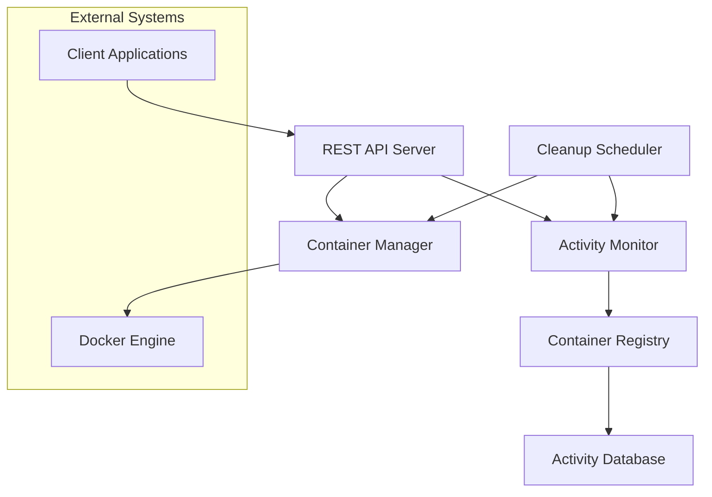

# Design Document

## Overview

The Docker On-Demand system is designed as a lightweight orchestration service that manages the lifecycle of Docker containers. The system consists of a REST API server, a container manager service, an activity monitor, and a cleanup scheduler. The architecture emphasizes simplicity, reliability, and efficient resource management while providing the flexibility to scale horizontally if needed.

## Architecture

The system follows a modular architecture with clear separation of concerns:



### Core Components

1. **REST API Server**: Handles incoming requests for container operations
2. **Container Manager**: Manages Docker container lifecycle operations
3. **Activity Monitor**: Tracks container activity and updates timestamps
4. **Cleanup Scheduler**: Periodically removes inactive containers
5. **Container Registry**: Maintains state of all managed containers
6. **Activity Database**: Stores container activity timestamps and metadata

## Components and Interfaces

### REST API Server

**Responsibilities:**

- Handle HTTP requests for container operations
- Validate request parameters and authentication
- Return structured responses with appropriate status codes
- Route requests to appropriate service components

**Key Endpoints:**

- `POST /containers` - Create new container
- `GET /containers` - List active containers
- `GET /containers/{id}` - Get container details
- `DELETE /containers/{id}` - Remove specific container
- `GET /health` - System health check

**Request/Response Format:**

```json
// Create Container Request
{
  "image": "string",
  "environment": {},
  "ports": []
}

// Container Response
{
  "id": "string",
  "status": "running|stopped|error",
  "connection": {
    "host": "string",
    "port": "number",
    "url": "string"
  },
  "created_at": "timestamp",
  "last_activity": "timestamp"
}
```

### Container Manager

**Responsibilities:**

- Interface with Docker Engine API
- Create and configure containers with unique identifiers
- Manage container networking and port allocation
- Handle container removal and cleanup
- Maintain container state information

**Key Methods:**

- `createContainer(config)` - Create new container instance
- `removeContainer(id)` - Remove container by ID
- `getContainer(id)` - Get container information
- `listContainers()` - List all managed containers
- `getContainerLogs(id)` - Retrieve container logs

### Activity Monitor

**Responsibilities:**

- Track container activity through various signals
- Update last activity timestamps
- Provide activity status for cleanup decisions
- Monitor container health and responsiveness

**Activity Detection Methods:**

- HTTP request monitoring (if containers expose web services)
- Docker stats API monitoring (CPU, memory, network usage)
- Container log activity monitoring
- Custom heartbeat mechanism

### Cleanup Scheduler

**Responsibilities:**

- Run periodic cleanup tasks based on configurable intervals
- Identify containers exceeding inactivity timeout
- Coordinate with Container Manager for safe removal
- Handle cleanup failures and retries
- Log cleanup operations for auditing

**Configuration Options:**

- `cleanup_interval` - How often to run cleanup (default: 60 seconds)
- `inactivity_timeout` - Container timeout period (default: 300 seconds)
- `max_retry_attempts` - Cleanup retry limit (default: 3)
- `force_removal_timeout` - Timeout for forced container removal

## Data Models

### Container Model

```typescript
interface Container {
  id: string;
  dockerId: string;
  image: string;
  status: "creating" | "running" | "stopping" | "stopped" | "error";
  createdAt: Date;
  lastActivity: Date;
  connection: {
    host: string;
    port: number;
    url?: string;
  };
  environment: Record<string, string>;
  metadata: Record<string, any>;
}
```

### Activity Record Model

```typescript
interface ActivityRecord {
  containerId: string;
  timestamp: Date;
  activityType: "http_request" | "resource_usage" | "heartbeat" | "manual";
  details?: Record<string, any>;
}
```

### Configuration Model

```typescript
interface SystemConfig {
  docker: {
    socketPath: string;
    defaultImage: string;
    networkMode: string;
    portRange: {
      start: number;
      end: number;
    };
  };
  cleanup: {
    interval: number;
    inactivityTimeout: number;
    maxRetryAttempts: number;
    forceRemovalTimeout: number;
  };
  api: {
    port: number;
    host: string;
    authEnabled: boolean;
  };
}
```

## Error Handling

### Container Creation Errors

- **Image not found**: Return 400 with clear error message
- **Port allocation failure**: Retry with different port or return 503
- **Docker daemon unavailable**: Return 503 with retry-after header
- **Resource constraints**: Return 507 with resource information

### Container Removal Errors

- **Container not found**: Log warning but continue cleanup
- **Removal timeout**: Force removal after configured timeout
- **Docker API errors**: Retry with exponential backoff
- **Persistent failures**: Alert administrators and skip container

### API Error Responses

```json
{
  "error": {
    "code": "CONTAINER_CREATE_FAILED",
    "message": "Failed to create container",
    "details": {
      "reason": "Image not found",
      "image": "requested-image:tag"
    },
    "timestamp": "2025-01-23T10:30:00Z"
  }
}
```

## Testing Strategy

### Unit Testing

- **Container Manager**: Mock Docker API responses for all operations
- **Activity Monitor**: Test activity detection and timestamp updates
- **Cleanup Scheduler**: Test timeout calculations and removal logic
- **API Endpoints**: Test request validation and response formatting

### Integration Testing

- **Docker Integration**: Test against real Docker daemon with test containers
- **End-to-End Workflows**: Test complete container lifecycle from creation to cleanup
- **Concurrent Operations**: Test multiple simultaneous container operations
- **Failure Scenarios**: Test system behavior during Docker daemon failures

### Performance Testing

- **Container Creation Speed**: Measure time to create containers under load
- **Cleanup Efficiency**: Test cleanup performance with many containers
- **Memory Usage**: Monitor system memory usage with varying container counts
- **API Response Times**: Test API performance under concurrent requests

### Test Environment Setup

- Use Docker-in-Docker for isolated testing
- Create test images with predictable behavior
- Implement test utilities for container state verification
- Set up automated testing pipeline with cleanup verification

## Security Considerations

### Container Isolation

- Use Docker's default security features (namespaces, cgroups)
- Configure resource limits to prevent resource exhaustion
- Implement network isolation between containers
- Use read-only root filesystems where possible

### API Security

- Implement authentication and authorization if required
- Validate all input parameters to prevent injection attacks
- Use HTTPS for production deployments
- Implement rate limiting to prevent abuse

### System Security

- Run service with minimal required privileges
- Secure Docker socket access with appropriate permissions
- Implement audit logging for all container operations
- Regular security updates for base images and dependencies
