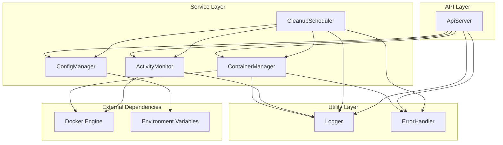

# System Components

This document provides detailed information about each component in the Docker On-Demand system, including their responsibilities, interfaces, dependencies, and implementation details.

## Component Overview



## API Layer Components

### ApiServer

**Location**: `src/api/server.ts`

#### Purpose
Provides the REST API interface for external clients to interact with the Docker On-Demand system.

#### Responsibilities
- HTTP request/response handling
- Request validation and sanitization
- API endpoint routing
- Error response formatting
- CORS and middleware management
- Health check reporting

#### Key Methods

```typescript
class ApiServer {
  constructor(containerManager?: ContainerManager, activityMonitor?: ActivityMonitor, configManager?: ConfigManager)
  
  // Lifecycle
  start(): Promise<void>
  getApp(): Express
  
  // Private endpoint handlers
  private handleHealthCheck(req: Request, res: Response, next: NextFunction): Promise<void>
  private handleCreateContainer(req: Request, res: Response, next: NextFunction): Promise<void>
  private handleListContainers(req: Request, res: Response, next: NextFunction): Promise<void>
  private handleGetContainer(req: Request, res: Response, next: NextFunction): Promise<void>
  private handleDeleteContainer(req: Request, res: Response, next: NextFunction): Promise<void>
}
```

#### Dependencies
- **ContainerManager**: For container lifecycle operations
- **ActivityMonitor**: For activity tracking and updates
- **ConfigManager**: For system configuration
- **Logger**: For request logging and debugging
- **ErrorHandler**: For error processing and response formatting

#### Configuration
Uses configuration from `ConfigManager` for:
- API server host and port
- Authentication settings (future feature)

#### Error Handling
- Comprehensive error middleware with HTTP status code mapping
- Structured error responses with consistent format
- Request ID generation for error tracking
- Docker-specific error handling and translation

---

## Service Layer Components

### ContainerManager

**Location**: `src/services/ContainerManager.ts`

#### Purpose
Core service responsible for Docker container lifecycle management and state tracking.

#### Responsibilities
- Docker container creation and removal
- Container state tracking and synchronization
- Port allocation and management
- Container metadata management
- Docker API interaction with retry logic

#### Key Methods

```typescript
class ContainerManager {
  constructor(configManager?: ConfigManager)
  
  // Container lifecycle
  createContainer(request: ContainerCreateRequest): Promise<Container>
  removeContainer(containerId: string): Promise<void>
  getContainer(containerId: string): Promise<Container | null>
  listContainers(): Promise<Container[]>
  
  // State management
  getActiveContainerCount(): number
  getContainerIds(): string[]
  hasContainer(containerId: string): boolean
  clear(): void // Testing only
}
```

#### Data Structures
- **containers**: `Map<string, Container>` - Active container registry
- **usedPorts**: `Set<number>` - Port allocation tracking

#### Dependencies
- **Docker**: dockerode client for Docker Engine API
- **ConfigManager**: For Docker configuration (socket path, default image, port range)
- **Logger**: For operation logging and debugging
- **ErrorHandler**: For Docker operation retry logic

#### Error Handling
- Custom `ContainerManagerError` with specific error codes
- Retry logic for transient Docker API failures
- Port cleanup on container creation failure
- Container state synchronization with Docker Engine

#### Port Management
- Automatic port allocation from configured range
- Port deallocation on container removal
- Port conflict detection and resolution

---

### ActivityMonitor

**Location**: `src/services/ActivityMonitor.ts`

#### Purpose
Monitors container activity through Docker stats API and maintains activity records for cleanup decisions.

#### Responsibilities
- Container activity detection via Docker stats
- Activity timestamp management
- Resource usage monitoring (CPU, memory, network)
- Activity record maintenance and cleanup

#### Key Methods

```typescript
class ActivityMonitor {
  constructor(docker: Docker)
  
  // Monitoring lifecycle
  startMonitoring(containerId: string, dockerId: string): void
  stopMonitoring(containerId: string): void
  
  // Activity management
  updateActivity(update: ActivityUpdate): void
  getLastActivity(containerId: string): Date | null
  getActivityRecord(containerId: string): ActivityRecord | null
  getAllActivityRecords(): Map<string, ActivityRecord>
  removeActivityRecord(containerId: string): void
  
  // System lifecycle
  cleanup(): void
}
```

#### Data Structures
- **activityRecords**: `Map<string, ActivityRecord>` - Activity history per container
- **monitoringIntervals**: `Map<string, NodeJS.Timeout>` - Active monitoring intervals

#### Dependencies
- **Docker**: dockerode client for stats API access
- **Logger**: For monitoring events and debugging
- **ErrorHandler**: For Docker stats API retry logic

#### Monitoring Strategy
- **Polling Interval**: 30-second intervals for Docker stats
- **Activity Detection**: CPU usage, memory changes, network I/O
- **Resource Thresholds**: Configurable thresholds for activity detection
- **Error Resilience**: Continues monitoring despite transient failures

#### Activity Types
- `manual`: User-initiated actions (creation, deletion)
- `resource_usage`: Detected through Docker stats monitoring

---

### CleanupScheduler

**Location**: `src/services/CleanupScheduler.ts`

#### Purpose
Automated cleanup service that removes inactive containers based on configurable policies.

#### Responsibilities
- Periodic cleanup task scheduling
- Inactivity detection and timeout management
- Retry logic for failed cleanup operations
- Cleanup history and reporting

#### Key Methods

```typescript
class CleanupScheduler {
  constructor(containerManager: ContainerManager, activityMonitor: ActivityMonitor, configManager?: ConfigManager)
  
  // Scheduler lifecycle
  start(): void
  stop(): void
  isSchedulerRunning(): boolean
  
  // Cleanup operations
  performManualCleanup(): Promise<CleanupSummary>
  
  // Status and history
  getCleanupHistory(): CleanupSummary[]
  getRetryQueueStatus(): Map<string, number>
}
```

#### Data Structures
- **retryQueue**: `Map<string, number>` - Failed containers with retry counts
- **cleanupHistory**: `CleanupSummary[]` - Historical cleanup results
- **cronJob**: `cron.ScheduledTask` - Scheduled cleanup task

#### Dependencies
- **ContainerManager**: For container removal operations
- **ActivityMonitor**: For activity timestamp queries
- **ConfigManager**: For cleanup configuration
- **Logger**: For cleanup operation logging
- **ErrorHandler**: For Docker operation retry logic
- **node-cron**: For task scheduling

#### Cleanup Algorithm
1. **Container Enumeration**: List all active containers
2. **Activity Check**: Query last activity timestamp for each container
3. **Timeout Calculation**: Compare activity age against configured timeout
4. **Removal Attempt**: Remove inactive containers with retry logic
5. **Retry Processing**: Process previously failed removals
6. **History Recording**: Store cleanup results for monitoring

#### Retry Logic
- **Max Attempts**: Configurable maximum retry attempts
- **Retry Queue**: Persistent queue for failed removals
- **Exponential Backoff**: Implemented via ErrorHandler
- **Abandonment**: Containers exceeding max retries are abandoned

---

### ConfigManager

**Location**: `src/services/ConfigManager.ts`

#### Purpose
Centralized configuration management with environment variable processing and validation.

#### Responsibilities
- Environment variable processing with defaults
- Configuration validation and error reporting
- Singleton pattern for consistent configuration access
- Type-safe configuration interfaces

#### Key Methods

```typescript
class ConfigManager {
  static getInstance(): ConfigManager
  
  // Configuration lifecycle
  loadConfig(): SystemConfig
  getConfig(): SystemConfig
  reset(): void // Testing only
}
```

#### Configuration Sections

##### Docker Configuration
```typescript
interface DockerConfig {
  socketPath: string;        // Docker daemon socket path
  defaultImage: string;      // Default container image
  networkMode: string;       // Docker network mode
  portRange: {
    start: number;           // Port allocation range start
    end: number;             // Port allocation range end
  };
}
```

##### Cleanup Configuration
```typescript
interface CleanupConfig {
  interval: number;                // Cleanup check interval (seconds)
  inactivityTimeout: number;       // Container inactivity timeout (seconds)
  maxRetryAttempts: number;        // Maximum retry attempts for failed cleanups
  forceRemovalTimeout: number;     // Force removal timeout (seconds)
}
```

##### API Configuration
```typescript
interface ApiConfig {
  port: number;              // API server port
  host: string;              // API server host
  authEnabled: boolean;      // Authentication enabled (future feature)
}
```

#### Dependencies
- **Environment Variables**: Process environment for configuration values
- **Logger**: Implicit through other components that use configuration

#### Validation Rules
- **Port Numbers**: Valid range 1-65535
- **Positive Integers**: Timeouts and intervals must be positive
- **Non-Empty Strings**: Required string fields cannot be empty
- **Range Validation**: Port range start must be less than end

#### Error Handling
- Custom `ConfigValidationError` with field-specific information
- Detailed validation error messages
- Fail-fast validation on configuration load

---

## Utility Layer Components

### Logger

**Location**: `src/utils/Logger.ts`

#### Purpose
Centralized logging system with structured output and multiple log levels.

#### Responsibilities
- Structured JSON logging
- Log level management
- Contextual logging with metadata
- Specialized logging methods for different event types

#### Key Methods

```typescript
class Logger {
  static getInstance(): Logger
  
  // Standard logging
  debug(component: string, message: string, metadata?: any): void
  info(component: string, message: string, metadata?: any): void
  warn(component: string, message: string, metadata?: any): void
  error(component: string, message: string, error?: Error, metadata?: any): void
  
  // Specialized logging
  logContainerOperation(operation: string, containerId: string, success: boolean, metadata?: any, error?: Error): void
  logSystemEvent(event: string, component: string, metadata?: any): void
}
```

#### Log Levels
- **DEBUG**: Detailed debugging information
- **INFO**: General information messages
- **WARN**: Warning conditions
- **ERROR**: Error conditions with optional Error objects

#### Log Format
```json
{
  "timestamp": "2025-01-23T10:00:00.000Z",
  "level": "INFO",
  "component": "ContainerManager",
  "message": "Container created successfully",
  "metadata": {
    "containerId": "abc123",
    "dockerId": "docker-id-123",
    "port": 8001
  }
}
```

#### Features
- **Singleton Pattern**: Consistent logger instance across application
- **Structured Output**: JSON format for log aggregation systems
- **Contextual Metadata**: Rich context information for debugging
- **Error Serialization**: Proper Error object serialization with stack traces

---

### ErrorHandler

**Location**: `src/utils/ErrorHandler.ts`

#### Purpose
Centralized error handling with retry logic and Docker-specific error processing.

#### Responsibilities
- Docker operation retry logic with exponential backoff
- Error classification and categorization
- Error context preservation
- Standardized error response creation

#### Key Methods

```typescript
class ErrorHandler {
  // Docker operation retry
  static executeDockerOperation<T>(
    operation: () => Promise<T>,
    operationName: string,
    options?: RetryOptions
  ): Promise<T>
  
  // Error processing
  static extractErrorInfo(error: any): ErrorInfo
  static createError(message: string, code: string, cause?: Error): Error
  static isRetryableError(error: any): boolean
}
```

#### Retry Configuration
```typescript
interface RetryOptions {
  maxAttempts?: number;      // Default: 3
  baseDelayMs?: number;      // Default: 1000
  maxDelayMs?: number;       // Default: 10000
  backoffMultiplier?: number; // Default: 2
}
```

#### Error Classification
- **Retryable Errors**: Network timeouts, connection refused, temporary Docker issues
- **Non-Retryable Errors**: Authentication failures, invalid requests, resource not found
- **Docker-Specific Errors**: Container not found, image not found, daemon unavailable

#### Retry Strategy
1. **Initial Attempt**: Execute operation immediately
2. **Failure Detection**: Classify error as retryable or non-retryable
3. **Backoff Calculation**: Exponential backoff with jitter
4. **Retry Execution**: Retry up to maximum attempts
5. **Final Failure**: Throw original error after exhausting retries

---

## Component Interactions

### Container Creation Flow
1. **API Request**: ApiServer receives container creation request
2. **Validation**: ApiServer validates request parameters
3. **Container Creation**: ContainerManager creates Docker container
4. **Activity Monitoring**: ActivityMonitor begins monitoring container
5. **Cleanup Registration**: CleanupScheduler includes container in monitoring
6. **Response**: ApiServer returns container information to client

### Container Cleanup Flow
1. **Scheduled Check**: CleanupScheduler runs periodic cleanup
2. **Container Enumeration**: Query ContainerManager for active containers
3. **Activity Query**: Check ActivityMonitor for last activity timestamps
4. **Timeout Detection**: Identify containers exceeding inactivity timeout
5. **Container Removal**: Use ContainerManager to remove inactive containers
6. **Activity Cleanup**: Remove activity records from ActivityMonitor

### Error Propagation
1. **Docker Error**: Docker operation fails in service layer
2. **Error Handling**: ErrorHandler processes and potentially retries operation
3. **Error Classification**: Error is classified and wrapped with context
4. **Service Response**: Service returns error to calling component
5. **API Response**: ApiServer formats error for HTTP response
6. **Client Response**: Structured error response sent to client

## Testing Strategy

### Unit Testing
- **Mocked Dependencies**: Each component tested with mocked dependencies
- **Error Scenarios**: Comprehensive error condition testing
- **State Management**: Verification of internal state changes
- **Configuration Validation**: Testing of configuration validation logic

### Integration Testing
- **Real Docker**: Integration tests use actual Docker containers
- **End-to-End Flows**: Complete request/response cycles
- **Concurrent Operations**: Multi-container and parallel operation testing
- **Failure Recovery**: Testing system behavior during failures

### Component Isolation
- **Dependency Injection**: Components accept dependencies for testability
- **Interface Contracts**: Clear interfaces between components
- **State Isolation**: Components maintain independent state
- **Error Boundaries**: Errors contained within component boundaries

---

*For architectural overview, see [System Overview](./overview.md)*  
*For request flow details, see [Data Flow Documentation](./data-flow.md)*  
*For extending components, see [Adding Services Guide](../guides/adding-services.md)*