# Data Flow Documentation

This document provides detailed sequence diagrams and data flow documentation for key operations in the Ephemeral system, including request/response flows, container lifecycle management, and cleanup processes.

## Overview

The Ephemeral system processes requests through multiple layers, with data flowing between the API layer, service layer, and external systems. Understanding these flows is crucial for debugging, extending functionality, and maintaining system reliability.

## Core Data Flow Patterns

### Request Processing Architecture

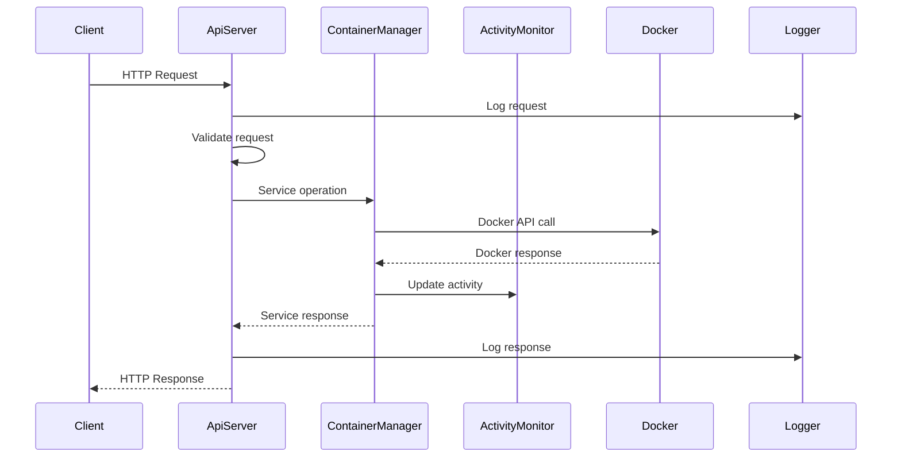

## Container Creation Flow

### Complete Container Creation Sequence

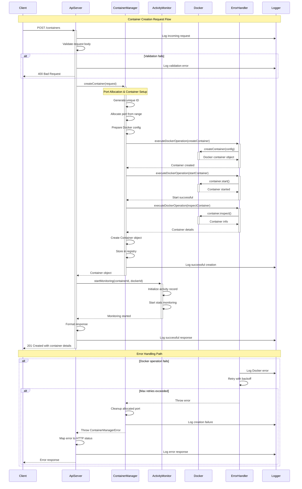

### Container Creation Data Transformation

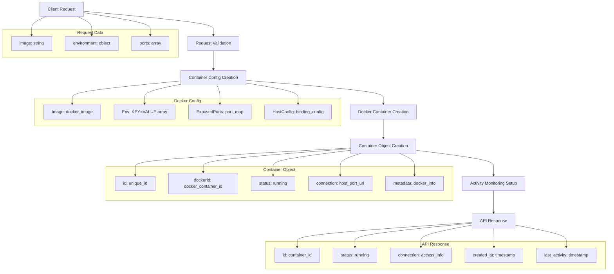

## Container Retrieval Flow

### Get Container Sequence

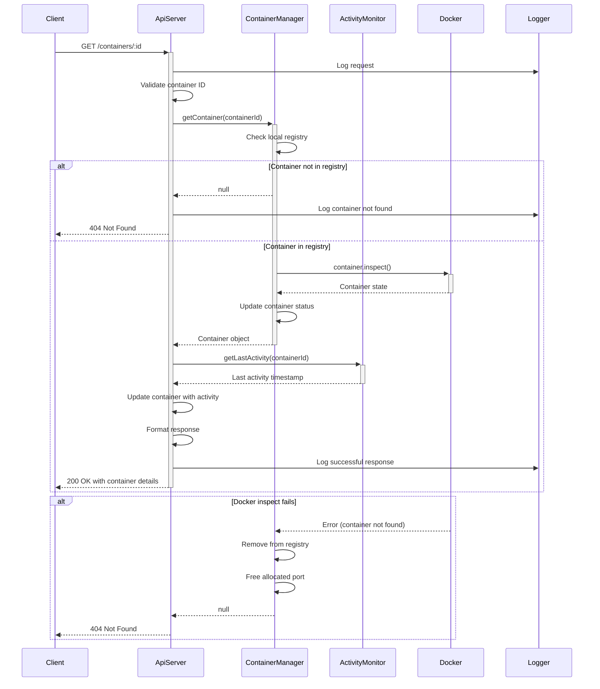

### List Containers Flow

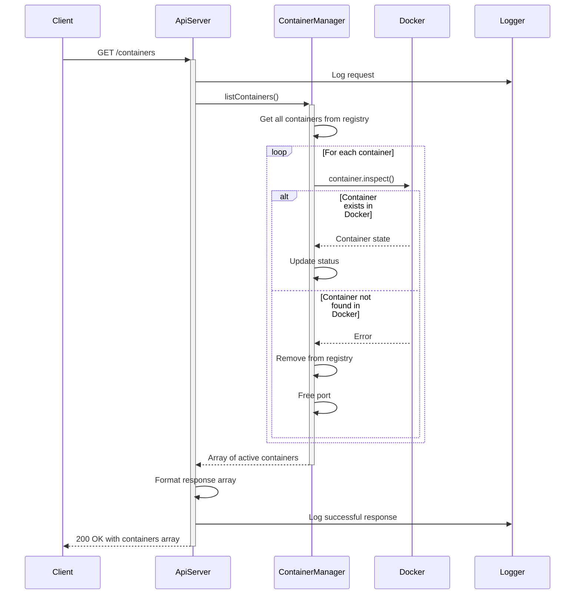

## Container Deletion Flow

### Complete Container Deletion Sequence

```mermaid
sequenceDiagram
    participant Client
    participant ApiServer
    participant ContainerManager
    participant ActivityMonitor
    participant Docker
    participant ErrorHandler
    participant Logger

    Client->>+ApiServer: DELETE /containers/:id
    ApiServer->>Logger: Log deletion request
    ApiServer->>ApiServer: Validate container ID
    
    ApiServer->>+ContainerManager: getContainer(containerId)
    ContainerManager-->>-ApiServer: Container object or null
    
    alt Container not found
        ApiServer->>Logger: Log container not found
        ApiServer-->>Client: 404 Not Found
    end
    
    ApiServer->>+ActivityMonitor: stopMonitoring(containerId)
    ActivityMonitor->>ActivityMonitor: Clear monitoring interval
    ActivityMonitor->>ActivityMonitor: Update activity record
    ActivityMonitor-->>-ApiServer: Monitoring stopped
    
    ApiServer->>+ContainerManager: removeContainer(containerId)
    
    ContainerManager->>+ErrorHandler: executeDockerOperation(stopContainer)
    ErrorHandler->>+Docker: container.stop()
    alt Stop successful
        Docker-->>-ErrorHandler: Container stopped
        ErrorHandler-->>ContainerManager: Stop successful
    else Stop fails
        Docker-->>-ErrorHandler: Stop error
        ErrorHandler-->>ContainerManager: Continue with removal
        ContainerManager->>Logger: Log stop warning
    end
    
    ContainerManager->>+ErrorHandler: executeDockerOperation(removeContainer)
    ErrorHandler->>+Docker: container.remove(force: true)
    Docker-->>-ErrorHandler: Container removed
    ErrorHandler-->>-ContainerManager: Remove successful
    
    ContainerManager->>ContainerManager: Free allocated port
    ContainerManager->>ContainerManager: Remove from registry
    ContainerManager->>Logger: Log successful removal
    ContainerManager-->>-ApiServer: Removal complete
    
    ApiServer->>+ActivityMonitor: removeActivityRecord(containerId)
    ActivityMonitor->>ActivityMonitor: Delete activity record
    ActivityMonitor-->>-ApiServer: Record removed
    
    ApiServer->>ApiServer: Format success response
    ApiServer->>Logger: Log successful deletion
    ApiServer-->>-Client: 200 OK with deletion confirmation

    alt Docker removal fails
        ErrorHandler->>Logger: Log Docker error
        ErrorHandler->>ErrorHandler: Retry with backoff
        alt Max retries exceeded
            ErrorHandler-->>ContainerManager: Throw error
            ContainerManager->>Logger: Log removal failure
            ContainerManager-->>ApiServer: Throw ContainerManagerError
            ApiServer->>Logger: Log error response
            ApiServer-->>Client: 500 Internal Server Error
        end
    end
```

## Activity Monitoring Flow

### Activity Monitoring Lifecycle

```mermaid
sequenceDiagram
    participant ContainerManager
    participant ActivityMonitor
    participant Docker
    participant Logger

    Note over ContainerManager,Logger: Monitoring Initialization
    ContainerManager->>+ActivityMonitor: startMonitoring(containerId, dockerId)
    ActivityMonitor->>ActivityMonitor: Create initial activity record
    ActivityMonitor->>ActivityMonitor: Start stats monitoring interval
    ActivityMonitor-->>-ContainerManager: Monitoring started

    Note over ActivityMonitor,Logger: Periodic Stats Collection
    loop Every 30 seconds
        ActivityMonitor->>ActivityMonitor: Check container stats
        ActivityMonitor->>+Docker: container.stats(stream: false)
        
        alt Container exists and has stats
            Docker-->>-ActivityMonitor: Container stats
            ActivityMonitor->>ActivityMonitor: Calculate CPU usage
            ActivityMonitor->>ActivityMonitor: Check network activity
            ActivityMonitor->>ActivityMonitor: Check memory usage
            
            alt Significant activity detected
                ActivityMonitor->>ActivityMonitor: Update activity record
                ActivityMonitor->>Logger: Log activity detection
            end
        else Container not found
            Docker-->>-ActivityMonitor: Container not found error
            ActivityMonitor->>Logger: Log container no longer exists
            ActivityMonitor->>ActivityMonitor: Stop monitoring
        end
    end

    Note over ActivityMonitor,Logger: Manual Activity Updates
    ActivityMonitor->>ActivityMonitor: updateActivity(manual action)
    ActivityMonitor->>ActivityMonitor: Store activity record
    ActivityMonitor->>Logger: Log manual activity update
```

### Activity Data Structure Flow

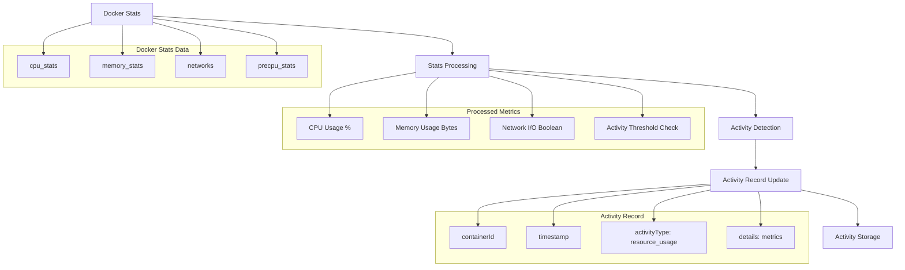

## Cleanup Process Flow

### Scheduled Cleanup Sequence

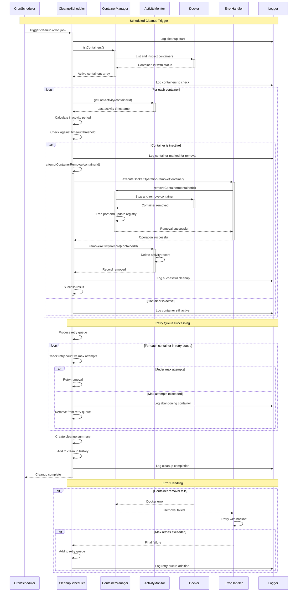

### Cleanup Decision Flow

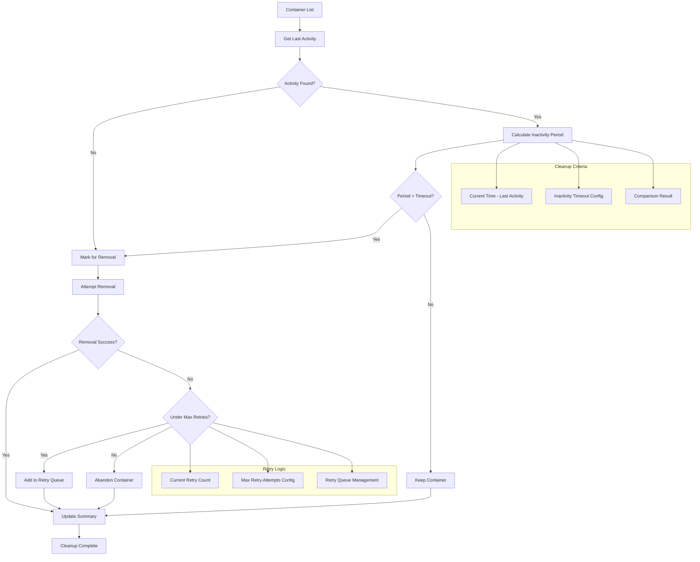

## Error Handling Flow

### Error Processing and Retry Logic

```mermaid
sequenceDiagram
    participant Service
    participant ErrorHandler
    participant Docker
    participant Logger

    Service->>+ErrorHandler: executeDockerOperation(operation, name, options)
    ErrorHandler->>ErrorHandler: Initialize retry attempt (1)
    
    loop Retry attempts (max 3)
        ErrorHandler->>+Docker: Execute operation
        
        alt Operation successful
            Docker-->>-ErrorHandler: Success result
            ErrorHandler-->>Service: Return result
        else Operation fails
            Docker-->>-ErrorHandler: Error
            ErrorHandler->>ErrorHandler: Classify error (retryable/non-retryable)
            
            alt Error is non-retryable
                ErrorHandler->>Logger: Log non-retryable error
                ErrorHandler-->>Service: Throw original error
            else Error is retryable AND attempts remaining
                ErrorHandler->>ErrorHandler: Calculate backoff delay
                ErrorHandler->>Logger: Log retry attempt
                ErrorHandler->>ErrorHandler: Wait (exponential backoff)
                ErrorHandler->>ErrorHandler: Increment attempt counter
            else Max attempts reached
                ErrorHandler->>Logger: Log final failure
                ErrorHandler-->>Service: Throw original error
            end
        end
    end
```

### Error Classification and Response Mapping

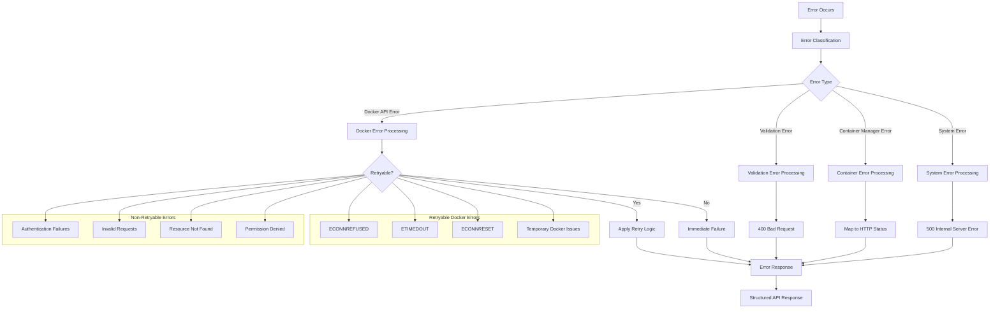

## Health Check Flow

### System Health Assessment

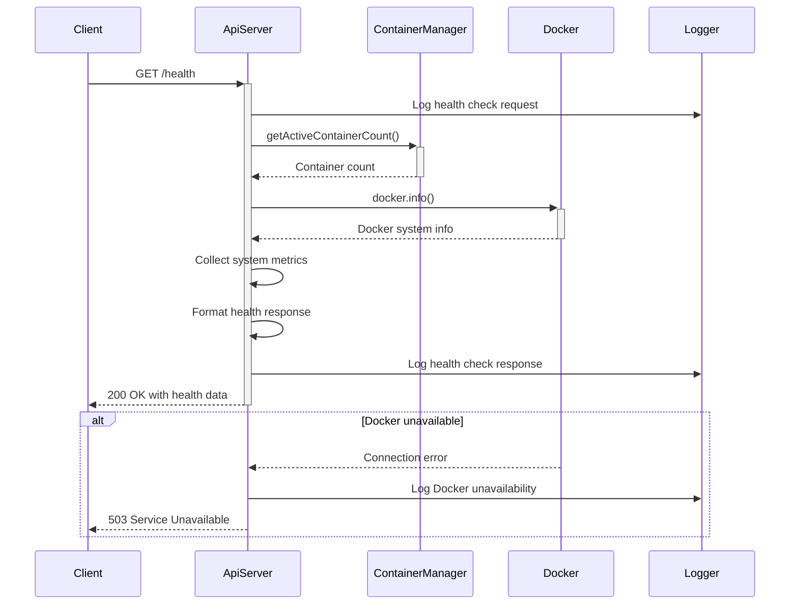

## Configuration Flow

### Configuration Loading and Validation

```mermaid
sequenceDiagram
    participant Application
    participant ConfigManager
    participant Environment
    participant Logger

    Application->>+ConfigManager: getInstance()
    ConfigManager->>ConfigManager: Check singleton instance
    
    alt First initialization
        ConfigManager->>+Environment: Read environment variables
        Environment-->>-ConfigManager: Environment values
        
        ConfigManager->>ConfigManager: Apply default values
        ConfigManager->>ConfigManager: Validate configuration
        
        alt Validation fails
            ConfigManager->>Logger: Log validation errors
            ConfigManager-->>Application: Throw ConfigValidationError
        end
        
        ConfigManager->>Logger: Log successful configuration load
        ConfigManager-->>-Application: ConfigManager instance
    else Already initialized
        ConfigManager-->>-Application: Existing instance
    end
```

## Data Persistence and State Management

### In-Memory State Management

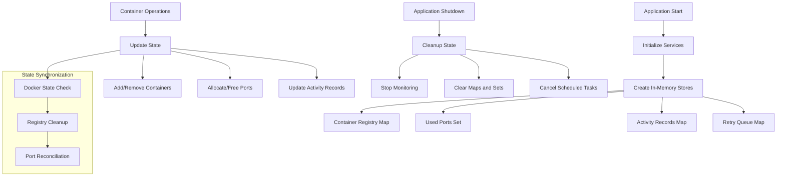

## Performance Considerations

### Request Processing Optimization

- **Connection Pooling**: Docker API connections are reused through dockerode client
- **Async Processing**: All Docker operations are asynchronous with proper error handling
- **Retry Logic**: Exponential backoff prevents overwhelming Docker daemon during failures
- **State Caching**: Container information cached in memory to reduce Docker API calls
- **Batch Operations**: Cleanup processes multiple containers efficiently

### Monitoring Efficiency

- **Polling Intervals**: 30-second intervals balance responsiveness with resource usage
- **Error Resilience**: Monitoring continues despite individual container failures
- **Resource Thresholds**: Activity detection uses configurable thresholds to avoid false positives
- **Cleanup Batching**: Multiple containers processed in single cleanup cycle

---

*For system architecture overview, see [System Overview](./overview.md)*  
*For detailed component information, see [Components Documentation](./components.md)*  
*For API endpoint details, see [API Documentation](../api/endpoints.md)*