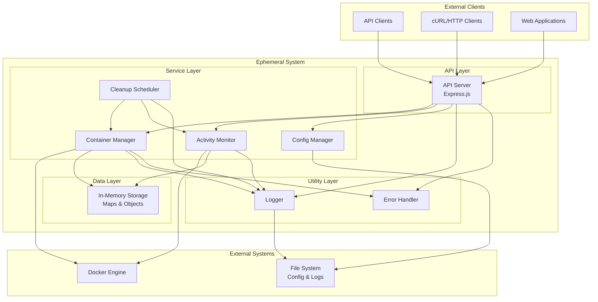

# System Architecture Overview

## Introduction

The Ephemeral system is a container orchestration platform designed to provide on-demand Docker container creation, automatic lifecycle management, and intelligent cleanup. The system follows a modular, service-oriented architecture built with TypeScript and Node.js.

## System Goals

### Primary Objectives
- **On-Demand Container Creation**: Dynamically create Docker containers via REST API
- **Automatic Lifecycle Management**: Monitor container activity and manage container lifecycles
- **Intelligent Cleanup**: Automatically remove inactive containers to optimize resource usage
- **Scalable Architecture**: Support concurrent container operations and high throughput
- **Operational Excellence**: Provide comprehensive monitoring, logging, and error handling

### Design Principles
- **Modularity**: Clear separation of concerns with well-defined service boundaries
- **Reliability**: Robust error handling and graceful degradation
- **Observability**: Comprehensive logging and monitoring capabilities
- **Maintainability**: Clean code architecture with extensive testing
- **Performance**: Efficient resource utilization and responsive operations

## Technology Stack

### Core Technologies
- **Runtime**: Node.js 18+
- **Language**: TypeScript 5.3+
- **Container Runtime**: Docker Engine via dockerode library
- **Web Framework**: Express.js 4.18+
- **Scheduling**: node-cron for cleanup operations

### Development Tools
- **Testing**: Vitest with coverage reporting
- **Linting**: ESLint with TypeScript support
- **Build**: TypeScript compiler (tsc)
- **Package Management**: npm

### Dependencies
- **dockerode**: Docker Engine API client
- **express**: Web application framework
- **node-cron**: Task scheduling library

## High-Level Architecture

## System Components

### API Layer

#### API Server
- **Purpose**: Provides REST API endpoints for container management
- **Technology**: Express.js with TypeScript
- **Responsibilities**:
  - HTTP request/response handling
  - Request validation and sanitization
  - Error response formatting
  - CORS and middleware management
  - Health check endpoints

### Service Layer

#### Container Manager
- **Purpose**: Core container lifecycle management
- **Responsibilities**:
  - Docker container creation and removal
  - Container state tracking
  - Port allocation and management
  - Container metadata management

#### Activity Monitor
- **Purpose**: Track container activity and usage patterns
- **Responsibilities**:
  - Container activity detection
  - Activity timestamp management
  - Usage pattern analysis
  - Activity record maintenance

#### Cleanup Scheduler
- **Purpose**: Automated cleanup of inactive containers
- **Responsibilities**:
  - Periodic cleanup task execution
  - Inactivity detection and timeout management
  - Retry logic for failed cleanups
  - Cleanup history and reporting

#### Config Manager
- **Purpose**: System configuration management
- **Responsibilities**:
  - Environment variable processing
  - Configuration validation
  - Default value management
  - Configuration change handling

### Utility Layer

#### Logger
- **Purpose**: Centralized logging system
- **Features**:
  - Structured JSON logging
  - Multiple log levels (debug, info, warn, error)
  - Contextual logging with metadata
  - Singleton pattern for consistency

#### Error Handler
- **Purpose**: Centralized error handling and recovery
- **Features**:
  - Error classification and categorization
  - Retry logic for transient failures
  - Error context preservation
  - Docker-specific error handling

## Data Flow Architecture

### Request Processing Flow
1. **API Request**: Client sends HTTP request to API server
2. **Validation**: Request validation and authentication
3. **Service Invocation**: API server calls appropriate service
4. **Docker Operation**: Service interacts with Docker Engine
5. **State Update**: Update in-memory state and activity records
6. **Response**: Return formatted response to client

### Container Lifecycle Flow
1. **Creation Request**: API receives container creation request
2. **Resource Allocation**: Allocate port and prepare configuration
3. **Docker Container Creation**: Create and start Docker container
4. **Activity Monitoring**: Begin monitoring container activity
5. **Cleanup Scheduling**: Register container for cleanup monitoring
6. **Automatic Removal**: Remove container when inactive timeout reached

### Monitoring and Cleanup Flow
1. **Periodic Check**: Cleanup scheduler runs at configured intervals
2. **Activity Analysis**: Check last activity for each container
3. **Timeout Detection**: Identify containers exceeding inactivity timeout
4. **Cleanup Execution**: Remove inactive containers with retry logic
5. **State Cleanup**: Remove activity records and update state

## Scalability Considerations

### Current Architecture Limitations
- **Single Instance**: Currently designed for single-instance deployment
- **In-Memory Storage**: State stored in memory, not persistent across restarts
- **Port Range**: Limited by configured port allocation range

### Future Scalability Enhancements
- **Distributed State**: Redis or database for shared state
- **Load Balancing**: Multiple API server instances
- **Container Orchestration**: Kubernetes integration
- **Persistent Storage**: Database for container metadata and activity logs

## Security Architecture

### Current Security Measures
- **Docker Socket Access**: Controlled access to Docker daemon
- **Input Validation**: Request validation and sanitization
- **Error Information**: Limited error information exposure
- **Resource Limits**: Port range and container resource constraints

### Security Considerations
- **Authentication**: Currently no authentication (future enhancement)
- **Authorization**: No role-based access control
- **Network Security**: Containers use default Docker networking
- **Resource Isolation**: Basic Docker container isolation

## Monitoring and Observability

### Logging Strategy
- **Structured Logging**: JSON format with consistent fields
- **Contextual Information**: Request IDs, container IDs, timestamps
- **Multiple Levels**: Debug, info, warning, error levels
- **Centralized Output**: All logs to stdout for container environments

### Health Monitoring
- **Health Endpoint**: `/health` endpoint for system status
- **Component Status**: Individual service health reporting
- **Resource Metrics**: Memory usage, container counts
- **Docker Integration**: Docker daemon connectivity status

### Error Tracking
- **Error Classification**: Categorized error types and codes
- **Error Context**: Full error context preservation
- **Retry Tracking**: Failed operation retry attempts
- **Recovery Metrics**: Success/failure rates for operations

## Deployment Architecture

### Development Environment
- **Local Docker**: Docker Desktop or Docker Engine
- **Node.js Runtime**: Direct Node.js execution
- **File-based Config**: Environment variables and .env files

### Production Considerations
- **Containerized Deployment**: Docker container deployment
- **Process Management**: PM2 or similar process manager
- **Log Aggregation**: Centralized logging system
- **Monitoring Integration**: Prometheus, Grafana, or similar

## Performance Characteristics

### Current Performance Profile
- **Container Creation**: ~2-5 seconds per container
- **API Response Time**: <100ms for most operations
- **Memory Usage**: ~50MB base + ~1MB per active container
- **Concurrent Operations**: Limited by Docker daemon capacity

### Performance Optimization Opportunities
- **Connection Pooling**: Docker API connection reuse
- **Caching**: Container state and metadata caching
- **Batch Operations**: Bulk container operations
- **Resource Monitoring**: Proactive resource management

---

*For detailed component information, see [Components Documentation](./components.md)*  
*For request flow details, see [Data Flow Documentation](./data-flow.md)*  
*For architectural decisions, see [Architectural Decision Records](./decisions/)*